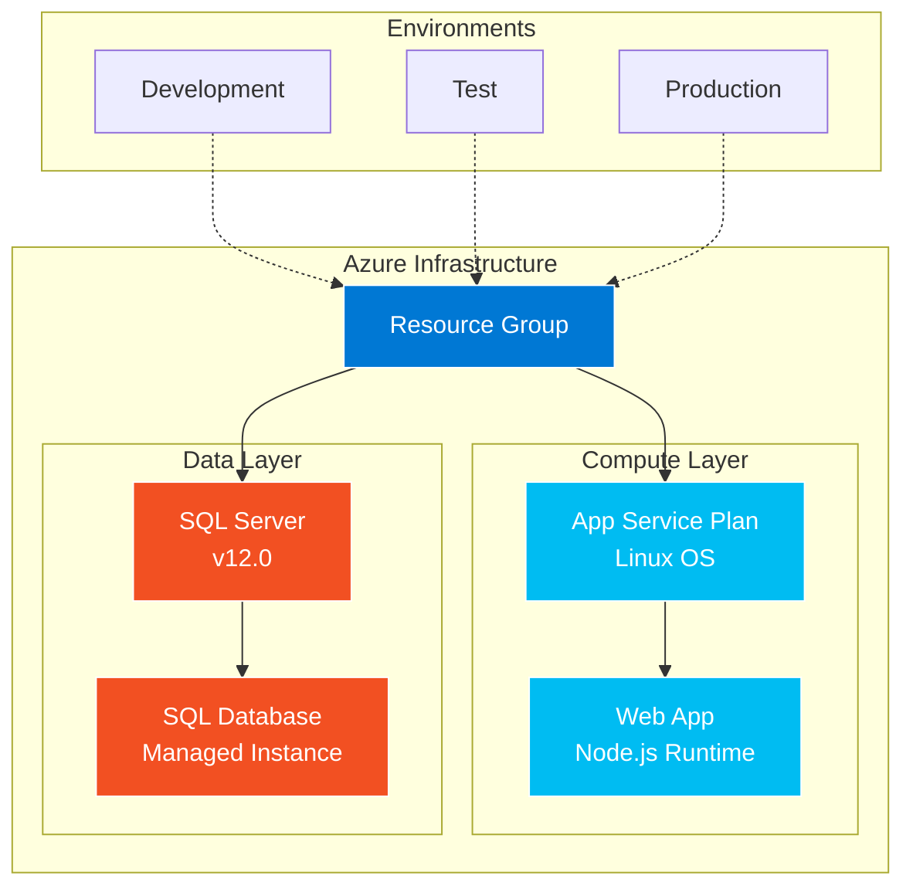
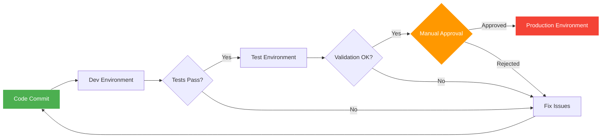
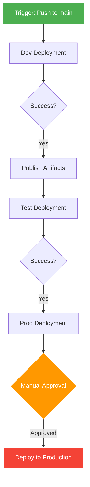

# Multi-Environment Azure Infrastructure (MultiEnv-App)


A production-ready **Infrastructure as Code (IaC)** solution for deploying multi-environment Azure infrastructure using Terraform. This project implements a complete web application stack with automated CI/CD pipelines across Development, Test, and Production environments.

## 📋 Table of Contents

- [Overview](#overview)
- [Architecture](#architecture)
- [Infrastructure Components](#infrastructure-components)
- [Project Structure](#project-structure)
- [Prerequisites](#prerequisites)
- [Getting Started](#getting-started)
- [Environment Configuration](#environment-configuration)
- [Deployment](#deployment)
- [Terraform Modules](#terraform-modules)
- [CI/CD Pipeline](#cicd-pipeline)
- [Best Practices](#best-practices)
- [Troubleshooting](#troubleshooting)

## 🎯 Overview

This project provides a scalable, maintainable infrastructure solution for deploying web applications on Microsoft Azure. It leverages **Terraform** for infrastructure provisioning and **Azure DevOps Pipelines** for automated deployments across multiple environments.

### Key Features

- ✅ **Multi-Environment Support**: Isolated Dev, Test, and Production environments
- ✅ **Modular Architecture**: Reusable Terraform modules for each infrastructure component
- ✅ **Automated CI/CD**: Azure DevOps pipeline with progressive deployment
- ✅ **Environment Isolation**: Terraform workspaces for state management
- ✅ **Production Safety**: Manual approval gates for production deployments
- ✅ **Resource Protection**: Lifecycle rules to prevent accidental resource deletion
- ✅ **Azure SQL Integration**: Managed database with enterprise features

## 🏗️ Architecture



### Deployment Pipeline Flow



## 🧩 Infrastructure Components

| Component | Description | Purpose |
|-----------|-------------|---------|
| **Resource Group** | Container for all Azure resources | Logical grouping and lifecycle management |
| **App Service Plan** | Compute infrastructure for web apps | Defines VM size, scaling, and OS (Linux) |
| **Web App** | Azure App Service | Hosts Node.js web application |
| **SQL Server** | Azure SQL Server instance | Managed database server with authentication |
| **SQL Database** | Azure SQL Database | Application data storage |

## 📁 Project Structure

```
MultiEnv-App/
├── terraform/
│   ├── modules/
│   │   ├── resource_group/      # Resource Group module
│   │   │   ├── main.tf
│   │   │   ├── variables.tf
│   │   │   └── outputs.tf
│   │   ├── app_service_plan/    # App Service Plan module
│   │   │   ├── main.tf
│   │   │   ├── variables.tf
│   │   │   └── outputs.tf
│   │   ├── web_app/             # Web App module
│   │   │   ├── main.tf
│   │   │   ├── variables.tf
│   │   │   └── outputs.tf
│   │   └── database/            # SQL Database module
│   │       ├── main.tf
│   │       ├── variables.tf
│   │       └── outputs.tf
│   ├── main.tf                  # Root module orchestration
│   ├── variables.tf             # Variable declarations
│   ├── outputs.tf               # Output values
│   ├── provider.tf              # Azure provider configuration
│   ├── dev.tfvars               # Development environment variables
│   ├── test.tfvars              # Test environment variables
│   └── prod.tfvars              # Production environment variables
├── infrastructure-pipeline.yml   # Azure DevOps CI/CD pipeline
└── README.md
```

## ✅ Prerequisites

Before deploying this infrastructure, ensure you have:

### Required Tools

- **Terraform** >= 1.5.0 ([Download](https://www.terraform.io/downloads))
- **Azure CLI** >= 2.0 ([Install Guide](https://docs.microsoft.com/en-us/cli/azure/install-azure-cli))
- **Azure DevOps** account with pipeline permissions
- **Git** for version control

### Azure Resources

- Active Azure subscription
- Service Principal with Contributor access (for Azure DevOps)
- Resource group creation permissions
- Self-hosted Azure DevOps agent (for pipeline execution)

### Access Requirements

- Azure subscription permissions for:
  - Creating Resource Groups
  - Deploying App Services
  - Provisioning SQL Databases
  - Managing service plans

## 🚀 Getting Started

### 1. Clone the Repository

```bash
git clone <repository-url>
cd MultiEnv-App
```

### 2. Authenticate with Azure

```bash
az login
az account set --subscription "<your-subscription-id>"
```

### 3. Initialize Terraform

```bash
cd terraform
terraform init
```

### 4. Review the Configuration

Examine the environment-specific variable files:

```bash
# Development environment
cat dev.tfvars

# Test environment
cat test.tfvars

# Production environment
cat prod.tfvars
```

## ⚙️ Environment Configuration

Each environment has its own `.tfvars` file with customized settings:

### Development Environment (`dev.tfvars`)

```hcl
rg_name         = "rg-dev"
location        = "Spain Central"
plan_name       = "plan-dev-10101"
web_app_name    = "webapp-dev-10101"
db_name         = "db-dev-10101"
db_server_name  = "db-server-dev-10101"
db_location     = "Spain Central"
db_password     = "Password123!"  # Use Key Vault in production
```

### Test Environment (`test.tfvars`)

```hcl
rg_name         = "rg-test"
location        = "Spain Central"
plan_name       = "plan-test-10101"
web_app_name    = "webapp-test-10101"
db_name         = "db-test-10101"
db_server_name  = "db-server-test-10101"
db_location     = "Spain Central"
db_password     = "Password123!"  # Use Key Vault in production
```

### Production Environment (`prod.tfvars`)

```hcl
rg_name         = "rg-prod"
location        = "Spain Central"
plan_name       = "plan-prod-10101"
web_app_name    = "webapp-prod-10101"
db_name         = "db-prod-10101"
db_server_name  = "db-server-prod-10101"
db_location     = "Spain Central"
db_password     = "Password123!"  # Use Key Vault in production
```

> [!WARNING]
> **Security Notice**: The current implementation stores database passwords in plain text. For production deployments, integrate **Azure Key Vault** to securely manage sensitive credentials.

## 🚢 Deployment

### Manual Deployment

#### Deploy to Development

```bash
cd terraform

# Create/Select workspace
terraform workspace new dev || terraform workspace select dev

# Plan deployment
terraform plan -var-file="dev.tfvars" -out=tfplan-dev

# Apply infrastructure
terraform apply tfplan-dev
```

#### Deploy to Test

```bash
# Create/Select workspace
terraform workspace new test || terraform workspace select test

# Plan deployment
terraform plan -var-file="test.tfvars" -out=tfplan-test

# Apply infrastructure
terraform apply tfplan-test
```

#### Deploy to Production

```bash
# Create/Select workspace
terraform workspace new prod || terraform workspace select prod

# Plan deployment
terraform plan -var-file="prod.tfvars" -out=tfplan-prod

# Apply infrastructure (requires confirmation)
terraform apply tfplan-prod
```

### Automated Deployment (Azure DevOps)

The project includes an Azure DevOps pipeline (`infrastructure-pipeline.yml`) that automates deployments:

1. **Push to main branch** triggers the pipeline
2. **Dev stage** deploys automatically
3. **Test stage** deploys after Dev succeeds
4. **Prod stage** requires manual approval

#### Pipeline Configuration

Update the service connections in `infrastructure-pipeline.yml`:

```yaml
variables:
  workingDirectory: 'terraform'
  environmentServiceConnectionDev: 'connection-rg-dev'
  environmentServiceConnectionTest: 'connection-test'
  environmentServiceConnectionProd: 'connection-prod'
```

## 🔧 Terraform Modules

### Resource Group Module

Creates an Azure Resource Group with lifecycle protection.

**Inputs:**
- `rg_name`: Resource group name
- `location`: Azure region

**Outputs:**
- `resource_group_name`: Name of created resource group

### App Service Plan Module

Provisions a Linux App Service Plan for hosting web applications.

**Inputs:**
- `name`: Service plan name
- `resource_group_name`: Parent resource group
- `location`: Azure region
- `os_type`: Operating system (default: Linux)
- `sku_name`: Pricing tier

**Outputs:**
- `plan_id`: Resource ID of the service plan

### Web App Module

Deploys a Node.js web application on Azure App Service.

**Inputs:**
- `name`: Web app name (must be globally unique)
- `resource_group_name`: Parent resource group
- `location`: Azure region
- `service_plan_id`: Associated service plan ID
- `node_version`: Node.js runtime version

**Outputs:**
- `webapp_url`: Public URL of the deployed web app

### Database Module

Creates Azure SQL Server and Database with enterprise features.

**Inputs:**
- `server_name`: SQL Server name (globally unique)
- `db_name`: Database name
- `resource_group_name`: Parent resource group
- `location`: Azure region
- `admin_login`: Administrator username (default: sqladmin)
- `admin_password`: Administrator password
- `sku_name`: Database SKU (default: Basic)

**Outputs:**
- `server_fqdn`: Fully qualified domain name
- `database_id`: Database resource ID

**Features:**
- SQL Server v12.0
- System-assigned managed identity
- Local storage redundancy
- Lifecycle protection against accidental deletion

## 🔄 CI/CD Pipeline

The Azure DevOps pipeline implements a **progressive deployment** strategy:

### Pipeline Stages



### Stage Details

#### 1. Development Stage
- **Trigger**: Automatic on main branch commit
- **Actions**:
  - Install Terraform 1.7.5
  - Initialize with local backend
  - Create/select `dev` workspace
  - Plan and apply infrastructure
  - Publish Terraform artifacts

#### 2. Test Stage
- **Trigger**: After Dev stage succeeds
- **Actions**:
  - Download artifacts from Dev stage
  - Initialize Terraform
  - Create/select `test` workspace
  - Plan and apply infrastructure

#### 3. Production Stage
- **Trigger**: After Test stage succeeds
- **Approval**: **Manual approval required**
- **Actions**:
  - Download artifacts from Dev stage
  - Initialize Terraform
  - Create/select `prod` workspace
  - Plan and apply infrastructure

### Pipeline Features

- ✅ **Self-hosted agent pool** for better control
- ✅ **Workspace isolation** per environment
- ✅ **Artifact publishing** for pipeline traceability
- ✅ **Manual approval gates** for production safety
- ✅ **Local state backend** (consider Azure Storage for team collaboration)

## 📌 Best Practices

### 1. State Management

> [!IMPORTANT]
> The current setup uses **local state** with workspaces. For team collaboration, migrate to **Azure Storage** backend:

```hcl
terraform {
  backend "azurerm" {
    resource_group_name  = "tfstate-rg"
    storage_account_name = "tfstatesa"
    container_name       = "tfstate"
    key                  = "multienv.terraform.tfstate"
  }
}
```

### 2. Secret Management

> [!CAUTION]
> Never commit sensitive values to version control. Use **Azure Key Vault**:

```hcl
data "azurerm_key_vault_secret" "db_password" {
  name         = "db-admin-password"
  key_vault_id = var.key_vault_id
}

resource "azurerm_mssql_server" "sql" {
  administrator_login_password = data.azurerm_key_vault_secret.db_password.value
  # ...
}
```

### 3. Resource Naming

Follow Azure naming conventions:
- Use consistent prefixes per environment (`rg-dev`, `rg-test`, `rg-prod`)
- Include unique identifiers for globally scoped resources
- Use lowercase and hyphens for readability

### 4. Cost Optimization

- Use appropriate SKUs per environment (Basic for dev, Standard+ for prod)
- Enable auto-scaling only where needed
- Implement resource tags for cost tracking
- Consider Azure Hybrid Benefit for licensing

### 5. Security Hardening

- Enable **Azure AD authentication** for SQL Server
- Configure **firewall rules** for database access
- Use **managed identities** instead of connection strings
- Enable **diagnostic logging** for monitoring
- Implement **network security groups** for traffic filtering

## 🐛 Troubleshooting

### Common Issues

#### Issue: Terraform workspace not found

```bash
Error: Workspace "dev" doesn't exist
```

**Solution:**
```bash
terraform workspace new dev
terraform workspace select dev
```

#### Issue: Resource name conflicts

```bash
Error: Name "webapp-dev-10101" already exists
```

**Solution:** Update the resource name in the corresponding `.tfvars` file with a unique identifier.

#### Issue: Authentication failures

```bash
Error: building AzureRM Client: authenticate to Azure: use Azure CLI
```

**Solution:**
```bash
az login
az account set --subscription "<subscription-id>"
```

#### Issue: Prevent_destroy lifecycle error

```bash
Error: Instance cannot be destroyed
```

**Solution:** This is intentional protection. To destroy resources:
1. Remove `prevent_destroy` from module's `lifecycle` block
2. Run `terraform apply` to update the state
3. Run `terraform destroy`

### Useful Commands

```bash
# List all workspaces
terraform workspace list

# Show current workspace
terraform workspace show

# Validate configuration
terraform validate

# Format code
terraform fmt -recursive

# View state
terraform state list

# Show specific resource
terraform state show module.webapp.azurerm_linux_web_app.app

# Refresh state
terraform refresh -var-file="dev.tfvars"
```

## 📚 Additional Resources

- [Terraform Azure Provider Documentation](https://registry.terraform.io/providers/hashicorp/azurerm/latest/docs)
- [Azure App Service Documentation](https://docs.microsoft.com/en-us/azure/app-service/)
- [Azure SQL Database Documentation](https://docs.microsoft.com/en-us/azure/azure-sql/)
- [Terraform Workspaces Guide](https://www.terraform.io/docs/language/state/workspaces.html)
- [Azure DevOps Pipelines Documentation](https://docs.microsoft.com/en-us/azure/devops/pipelines/)

---

**Project Status**: ✅ Production Ready

**Maintained by**: Cloud Infrastructure Team

**Last Updated**: February 2026
